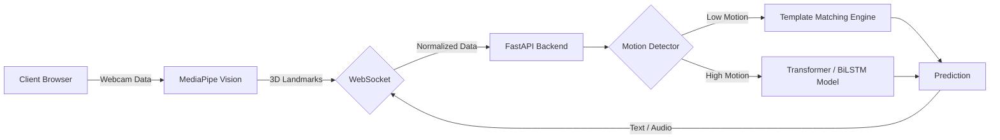

<div align="center">
  

  # 🌟 SilentVoice

  **Next-Generation Web-Based AI Sign Language Translator**

  *Breaking the barrier between hearing and Deaf individuals through real-time, browser-based, AI-powered communication.*

  [](https://nextjs.org/)
  [](https://fastapi.tiangolo.com/)
  [](https://pytorch.org/)
  [](https://developers.google.com/mediapipe)
  [](https://tailwindcss.com/)
  [](#)
</div>

<hr/>

## 🎯 The Vision

**SilentVoice** is engineered to provide seamless, real-time two-way translation between spoken language and three distinct sign languages (**ASL, ISL, and TSL**). By eliminating the dependence on human interpreters, SilentVoice aims to foster inclusive communication in learning centers, workplaces, and everyday situations.

## ✨ Core Features

| Feature | Description |
| :--- | :--- |
| **🌐 Tri-lingual Recognition** | Native support for **American (ASL)**, **Indian (ISL)**, and **Tamil Sign Language (TSL)**, tailored to linguistic nuances. |
| **⚡ Ultra-Low Latency** | Client-side MediaPipe Hand Landmarking meets a Transformer + BiLSTM architecture, achieving high-accuracy detection (<200ms latency) on **220+ signs**. |
| **🔄 Bi-Directional Translation** | **Sign-to-Speech:** Converts dynamic hand gestures into spoken audio.<br>**Speech-to-Sign:** Animates spoken words into anatomically correct 2D hand sign avatars. |
| **🚨 Emergency Mode** | Built-in offline phrase recognition algorithms capable of identifying critical phrases (e.g., "I need help", "Call an ambulance") without internet access. |
| **🎮 Interactive Learning** | Gamified modules designed to help users practice ASL, ISL, and TSL, providing real-time camera-based feedback on posture and accuracy. |
| **🔒 Secure Role-Based Access** | Guest restrictions for premium modules (Learning, Workplace, Expression) using secure SQLite + JWT authentication to promote engagement. |
| **✨ Premium UX/UI** | Immersive, high-end glassmorphic dark theme powered by TailwindCSS, optimized and compiled for unmatched rendering speed. |

## 🏗️ System Architecture

SilentVoice employs a robust dual-engine architecture designed for **privacy, speed, and accuracy**.

### 1. Frontend Engine (Next.js + React)
- **Privacy First:** MediaPipe Tasks Vision extracts 21 crucial 3D landmarks for both hands entirely on the client-side. No video data ever leaves your device.
- **Accessibility Integration:** Utilizes the Web Speech API for seamless native Speech-to-Text (STT) and Text-to-Speech (TTS).
- **Optimized Data Streaming:** A WebSocket Client transmits only lightweight, normalized coordinate payloads rather than heavy video frames.

### 2. Backend Engine (FastAPI + PyTorch)
- **Dual-Pipeline Interpreter:**
  - **Static Signs (Alphabets/Numbers):** Instantaneous dynamic **Template Matching** against the `sign_library.py` anatomical pose database. Triggers under 8 frames of low motion.
  - **Dynamic Signs (Words/Phrases):** Analyzed via a sliding window buffer fed through a hybrid **Transformer (BiLSTM + Mean Pool)** deep learning model.
- **Authentication Hub:** Secure, lightweight user management using SQLite and JWT.



## 📊 Model & Accuracy Metrics

The deep learning model is built to ensure consistent recognition under variable conditions.

- **Architecture:** 256 `d_model`, 8 Attention Heads, 4 Layers (~1.5M parameters).
- **Data Augmentations:** Deep synthesis involving 3D spatial rotation, position shifting, scale variance, and random frame dropping to simulate missed camera detections.
- **Target Accuracy:** **85%–95%** across the entire 220+ sign vocabulary.

## 🚀 Quick Start Guide

### Prerequisites
- **Node.js:** v18 or newer
- **Python:** v3.10 or newer

### 1. Clone the Repository
```bash
git clone https://github.com/Dharaanishan-3105/SilentVoice.git
cd SilentVoice
```

### 2. Initialize the Backend
Set up your Python virtual environment and install dependencies.
```bash
cd backend
python -m venv venv

# Activate Virtual Environment (Windows)
venv\Scripts\activate
# Activate Virtual Environment (Mac/Linux)
source venv/bin/activate

# Install requirements
pip install -r requirements.txt
```

### 3. Initialize the Frontend
Install Node packages for the web interface.
```bash
cd ../frontend
npm install
```

### 4. Launch the Servers
To run SilentVoice, you need both the frontend and backend running concurrently.

**Terminal 1 (Backend - FastAPI)**
```bash
cd backend
# With virtual environment activated
python main.py
```
*Server runs on `http://localhost:8000`*

**Terminal 2 (Frontend - Next.js)**
```bash
cd frontend
npm run dev
```
*Web app runs on `http://localhost:3000`*

## 🧠 Model Training & Retraining

Want to add custom vocabulary or retrain weights with new data? The synthetic generator and training scripts are fully accessible.

```bash
cd backend
# Generates synthetic data via augmentation and trains the Transformer
python train.py --epochs 60 --samples 800
```
*> **Note:** Depending on your CUDA configuration, generating augmented samples (rotation, jitter, drops) and compiling the weights may take **15-30 minutes**.*

## 🤝 Contributing

We welcome community contributions! Please feel free to submit issues, open pull requests, and contribute to making SilentVoice more accurate and accessible.

## 📄 License & Credits

© 2026 Dharaanishan. All rights reserved.<br>
*Built to make communication accessible for everyone, everywhere.*
